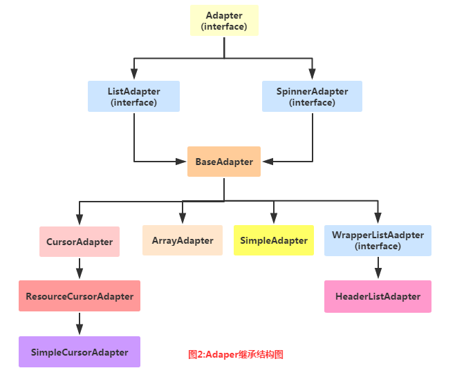
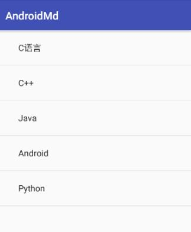

# ListView 详解

## 1.MVC模式的简单理解
在开始学习Adapter之前我们要来了解下这个MVC模式概念： 举个例子：大型的商业程序通常由多人一同开发完成,比如有人负责操作接口的规划与设计, 有人负责程序代码的编写如果要能够做到程序项目的分工就必须在程序的结构上做适合的安排 ,如果,接口设计与修改都涉及到程序代码的改变的话,那么两者的分工就会造成执行上的困难 良好的程序架构师将整个程序项目划分为如图的三个部分:


关系图解析：

- Model：通常可以理解为数据,负责执行程序的核心运算与判断逻辑,,通过view获得用户 输入的数据,然后根据从数据库查询相关的信息,最后进行运算和判断,再将得到的结果交给view来显示
- view:用户的操作接口,说白了就是GUI,应该使用哪种接口组件,组件间的排列位置与顺序都需要设计
- Controller:控制器,作为model与view之间的枢纽,负责控制程序的执行流程以及对象之间的一个互动

而这个Adapter则是中间的这个Controller的部分： Model(数据) ---> Controller(以什么方式显示到)---> View(用户界面) 这就是简单MVC组件的简单理解！

## 2.Adapter概念解析
首先我们来看看他的继承结构图：



上面就是Adapter以及继承结构图了，接着我们介绍一下实际开发中还用到的几个Adapter吧！

- BaseAdapter：抽象类，实际开发中我们会继承这个类并且重写相关方法，用得最多的一个Adapter！
- ArrayAdapter：支持泛型操作，最简单的一个Adapter，只能展现一行文字~
- SimpleAdapter：同样具有良好扩展性的一个Adapter，可以自定义多种效果！
- SimpleCursorAdapter：用于显示简单文本类型的listView，一般在数据库那里会用到，不过有点过时，
不推荐使用！

其实一个BaseAdapter就够玩的了，至于其他的，实际开发中用得不多，后面用到在讲解~

## 3.代码示例：
好的，多说无益，写代码最实际，接下来我们来用写几个简单的Adapter实例， 帮助我们了解Adapter给我们
带来的便利，另外，因为Adapter需要结合ListView， GridView等等控件讲解，一些高级一点的用法我们都
放在ListView那里讲！ 这里就简单演示下效果，另外这里用到的控件是ListView，下一节就会讲解， 现在
看不懂也没关系！
### 1）ArrayAdapter使用示例：
运行效果图：

  

```
public class MainActivity extends AppCompatActivity {
    private ListView listView;
    @Override
    protected void onCreate(Bundle savedInstanceState) {
        super.onCreate(savedInstanceState);
        setContentView(R.layout.activity_main);
        //获取ListView对象，通过调用setAdapter方法为ListView设置Adapter设置适配器
        listView = (ListView)findViewById(R.id.listview);
        //------使用ArrayAdapter
        //要显示的数据
        String[] strs = {"C语言","C++","Java","Android","Python"};
        //创建ArrayAdapter
        ArrayAdapter<String> adapter = new ArrayAdapter<String>
                (this,android.R.layout.simple_expandable_list_item_1,strs);
        listView.setAdapter(adapter);
        //------
    }
}
```

一些相关的东西：

- 1.除了通过数组外，我们还可以写到一个数组资源文件中：

比如：在res\valuse下创建一个数组资源的xml文件：arrays.xml：
```
<?xml version="1.0" encoding="utf-8"?>
<resources>
    <string-array name="myarray">
    <item>语文</item>
    <item>数学</item>
    <item>英语</item>
    </string-array>
</resources>
```
接着布局的listview属性设置下这个列表项：
```
<ListView
        android:id="@id/list_test"
        android:layout_height="match_parent"
        android:layout_width="match_parent"
        android:entries="@array/myarray"/>
```
就可以了~

当然我们也可以在Java代码中这样写：
```
ArrayAdapter<CharSequence> adapter = ArrayAdapter.createFromResource(this,
        R.array.myarray,android.R.layout.simple_list_item_multiple_choice );
```
同样也是可以的！

- 2.一开始也说了这个ArrayAdapter支持泛型，那么集合必不可少啦，比如，这样写：
```
List<String> data = new ArrayList<String>();
data.add("郑州");
data.add("开封")；
ArrayAdapter<String> adapter = new ArrayAdapter<String>
                (this,android.R.layout.simple_expandable_list_item_1,data);
```
就可以了~

3.我们看到了在实例化ArrayAdapter的第二个参数： android.R.layout.simple_expandable_list_item_1
其实这些是系统给我们提供好的一些ListView模板，有下面几种：

    - simple_list_item_1 : 单独一行的文本框
    - simple_list_item_2 : 两个文本框组成
    - simple_list_item_checked : 每项都是由一个已选中的列表项
    - simple_list_item_multiple_choice : 都带有一个复选框
    - simple_list_item_single_choice : 都带有一个单选钮

### 2）SimpleAdapter使用示例：
SimpleAdapter：简单的Adapter，看似简单，功能强大，下面我们来写个稍微复杂一点的列表 布局吧！

运行效果图：


代码实现：

先来编写一个列表项目每一项的布局：list_item.xml
```
<?xml version="1.0" encoding="utf-8"?>
<android.support.constraint.ConstraintLayout
    xmlns:android="http://schemas.android.com/apk/res/android"
    xmlns:app="http://schemas.android.com/apk/res-auto"
    android:layout_width="match_parent"
    android:layout_height="match_parent">
    <!-- 定义一个用于显示头像的ImageView -->
    <ImageView
        android:id="@+id/imgtou"
        android:layout_width="64dp"
        android:layout_height="64dp"
        app:layout_constraintLeft_toLeftOf="parent"
        app:layout_constraintTop_toTopOf="parent"
        android:paddingLeft="8dp" />
    <TextView
        android:id="@+id/name"
        android:layout_width="wrap_content"
        android:layout_height="wrap_content"
        android:paddingLeft="8dp"
        android:paddingTop="8dp"
        app:layout_constraintLeft_toRightOf="@id/imgtou"
        app:layout_constraintTop_toTopOf="@id/imgtou"
        android:text="name"
        android:textColor="#1D1D1C"
        android:textSize="20sp" />

    <TextView
        android:id="@+id/descript"
        android:layout_width="wrap_content"
        android:layout_height="wrap_content"
        android:paddingLeft="16px"
        app:layout_constraintLeft_toRightOf="@id/imgtou"
        app:layout_constraintTop_toBottomOf="@id/name"
        android:text="descript"
        android:textColor="#B4B4B9"
        android:textSize="14sp" />
</android.support.constraint.ConstraintLayout>
```
接下来是MainActivity.java:
```
private void useSimpleAdapter() {
        String[] names = new String[]{"关羽", "赵云", "张飞"};
        String[] says = new String[]{"关二爷", "常胜将军~", "哇呀呀呀"};
        int[] imgIds = new int[]{R.mipmap.boy_1, R.mipmap.boy_2, R.mipmap.girl_1};

        List<Map<String, Object>> listitem = new ArrayList<Map<String, Object>>();
        for (int i = 0; i < names.length; i++) {
            Map<String, Object> showitem = new HashMap<String, Object>();
            showitem.put("touxiang", imgIds[i]);
            showitem.put("name", names[i]);
            showitem.put("descript", says[i]);
            listitem.add(showitem);
        }

        //创建一个simpleAdapter
        SimpleAdapter myAdapter = new SimpleAdapter(getApplicationContext(), listitem,
                R.layout.list_item, new String[]{"touxiang", "name", "descript"},
                new int[]{R.id.imgtou, R.id.name, R.id.descript});
        listView.setAdapter(myAdapter);
    }
```
> 由于SimpleCursorAdapter已经提示过时，在此不在举例，如有需要，请自行百度。

### 3）BaseAdapter使用示例：
ArrayAdapter和SimpleAdapter都是继承自BaseAdapter，而在实际应用中，BaseAdapter使用的更加广泛。
仍然实现上面的例子，数据使用List进行存储，首先创建一个Java Bean：User，代码如下：
```
public class User {
    private int imageId;
    private String name;
    private String descript;
    (省略get、set)
}
```
在MainActivity中，添加如下方法：
```
private void useBaseAdapter() {
        String[] names = new String[]{"关羽", "赵云", "张飞"};
        String[] desc = new String[]{"关二爷", "常胜将军~", "哇呀呀呀"};
        int[] imgIds = new int[]{R.mipmap.boy_1, R.mipmap.boy_2, R.mipmap.girl_1};
        List<User> users = new ArrayList<>();
        for (int i = 0; i <names.length ; i++) {
            User user = new User();
            user.setName(names[i]);
            user.setDescript(desc[i]);
            user.setImageId(imgIds[i]);
            users.add(user);
        }
        MyAdapter myAdapter = new MyAdapter(this,users);
        listView.setAdapter(myAdapter);
    }
```
其中，MyAdapter的定义如下：
```
public class MyAdapter extends BaseAdapter {
    private List<User> users;
    private Context context;

    /**
     * 构造函数
     * @param context：上下文，用来加载布局用
     * @param users：数据
     */
    public MyAdapter(Context context,List<User> users){
        this.context = context;
        this.users = users;
    }
    @Override
    public int getCount() {//决定显示数据的数量
        return users.size();
    }

    @Override
    public Object getItem(int position) {
        return users.get(position);
    }

    @Override
    public long getItemId(int position) {
        return position;
    }
    //最重要的：决定每个Item的View（即如何显示）
    @Override
    public View getView(int position, View convertView, ViewGroup parent) {
        View view = LayoutInflater.from(context).inflate(R.layout.list_item,null);
        ImageView imageView = (ImageView)view.findViewById(R.id.imgtou);
        TextView tvName = (TextView)view.findViewById(R.id.name);
        TextView tvDesc = (TextView)view.findViewById(R.id.descript);
        User user = users.get(position);
        imageView.setImageResource(user.getImageId());
        tvName.setText(user.getName());
        tvDesc.setText(user.getDescript());
        return view;
    }
}
```

listview作为一个列表控件，他和普通的列表一样，可以自己设置表头与表尾： 以及分割线，可供我们设置的属性如下：

- footerDividersEnabled：是否在footerView(表尾)前绘制一个分隔条,默认为true
- headerDividersEnabled:是否在headerView(表头)前绘制一个分隔条,默认为true
- divider:设置分隔条,可以用颜色分割,也可以用drawable资源分割
- dividerHeight:设置分隔条的高度
翻遍了了API发现并没有可以直接设置ListView表头或者表尾的属性，只能在Java中写代码进行设置了，可供我们调用的方法如下：

- addHeaderView(View v)：添加headView(表头),括号中的参数是一个View对象
- addFooterView(View v)：添加footerView(表尾)，括号中的参数是一个View对象
- addHeaderView(headView, null, false)：和前面的区别：设置Header是否可以被选中
- addFooterView(View,view,false)：同上
对了，使用这个addHeaderView方法必须放在listview.setAdapter前面，否则会报错。
示例：
```
    private void useBaseAdapter() {
        String[] names = new String[]{"关羽", "赵云", "张飞"};
        String[] desc = new String[]{"关二爷", "常胜将军~", "哇呀呀呀"};
        int[] imgIds = new int[]{R.mipmap.boy_1, R.mipmap.boy_2, R.mipmap.girl_1};
        List<User> users = new ArrayList<>();
        for (int i = 0; i <names.length ; i++) {
            User user = new User();
            user.setName(names[i]);
            user.setDescript(desc[i]);
            user.setImageId(imgIds[i]);
            users.add(user);
        }
        //动态加载顶部View和底部View
        final LayoutInflater inflater = LayoutInflater.from(this);
        View headView = inflater.inflate(R.layout.view_header, null, false);
        View footView = inflater.inflate(R.layout.view_footer, null, false);
        listView.addHeaderView(headView);
        listView.addFooterView(footView);
        MyAdapter myAdapter = new MyAdapter(this,users);
        listView.setAdapter(myAdapter);
        listView.setOnItemClickListener(new AdapterView.OnItemClickListener() {
            @Override
            public void onItemClick(AdapterView<?> parent, View view, int position, long id) {
                Toast.makeText(MainActivity.this, "Position:"+position, Toast.LENGTH_SHORT).show();
            }
        });
    }
```
其中，view_header和view_footer两个布局文件类似，在此只给出其中一个：
```
<?xml version="1.0" encoding="utf-8"?>
<LinearLayout xmlns:android="http://schemas.android.com/apk/res/android"
    android:layout_width="match_parent"
    android:layout_height="match_parent"
    android:orientation="vertical"
    android:gravity="center">
    <TextView
        android:layout_width="match_parent"
        android:layout_height="48dp"
        android:textSize="18sp"
        android:text="表头"
        android:gravity="center"
        android:background="#43BBEB"
        android:textColor="#FFFFFF"/>
</LinearLayout>
```
> 注意：添加表头表尾后，我们发现positon是从表头开始算的，就是你添加的第一个数据本来的
postion 是 0，但是此时却变成了 1，因为表头也算！！

- 列表从底部开始显示：stackFromBottom，如果你想让列表显示你列表的最下面的话，那么你可以使用
这个属性，将stackFromBottom 属性设置为true即可

### 4）BaseAdapter优化：
上一节中我们学习了如何来使用一个ListView以及自定义一个简单的BaseAdapter，我们从代码
中可以看出比较重要的两个方法:getCount()和getView()，界面上有多少列就会调用多少次getView，
这个时候可能看出一些端倪，每次都是新inflate一个View，都要进行这个XML的解析，这样会
很浪费资源，当然，几十列或者几百列的列表并不能体现什么问题，但假如更多或者布局更加复杂？
所以学习ListView的优化很重要，而本节针对的是BaseAdapter的优化，优化的两点有，复用convertView
以及使用ViewHolder重用组件，不用每次都findViewById，我们具体通过代码来体会吧！

- 1.复用ConvertView：
  上面也说了，界面上有多少个Item，那么getView方法就会被调用多少次！ 我们来看看上一节我们写的getView()部分的代码：
```
      public View getView(int position, View convertView, ViewGroup parent) {
          View view = LayoutInflater.from(context).inflate(R.layout.list_item,null);
          ImageView imageView = (ImageView)view.findViewById(R.id.imgtou);
          TextView tvName = (TextView)view.findViewById(R.id.name);
          TextView tvDesc = (TextView)view.findViewById(R.id.descript);
          User user = users.get(position);
          imageView.setImageResource(user.getImageId());
          tvName.setText(user.getName());
          tvDesc.setText(user.getDescript());
          return view;
      }
```
inflate()每次都要加载一次xml，其实这个convertView是系统提供给我们的可供复用的View 的缓存对象，
那就作下判断咯，修改下，优化后的代码：
```
    public View getView(int position, View convertView, ViewGroup parent) {
          if(convertView == null){
                convertView = LayoutInflater.from(context).inflate(R.layout.list_item,null);
          }
          ImageView imageView = (ImageView)convertView.findViewById(R.id.imgtou);
          TextView tvName = (TextView)convertView.findViewById(R.id.name);
          TextView tvDesc = (TextView)convertView.findViewById(R.id.descript);
          User user = users.get(position);
          imageView.setImageResource(user.getImageId());
          tvName.setText(user.getName());
          tvDesc.setText(user.getDescript());
          return convertView;
     }
```
- 2.ViewHolder重用组件
getView()会被调用多次，那么findViewById不一样得调用多次，而我们的ListView的Item
一般都是一样的布局，我们可以对这里在优化下，我们可以自己定义一个ViewHolder类来对
这一部分 进行性能优化！修改后的代码如下：
```
    //最重要的：决定每个Item的View（即如何显示）
    @Override
    public View getView(int position, View convertView, ViewGroup parent) {
        ViewHolder holder = null;
        if(convertView==null) {
            convertView = LayoutInflater.from(context).inflate(R.layout.list_item, null);
            holder = new ViewHolder();
            holder.img_icon = (ImageView)convertView.findViewById(R.id.imgtou);
            holder.txt_aName = (TextView)convertView.findViewById(R.id.name);
            holder.txt_aDesc = (TextView)convertView.findViewById(R.id.descript);
            convertView.setTag(holder);//将Holder存储到convertView中
        }else {
            holder = (ViewHolder) convertView.getTag();
        }

        User user = users.get(position);
        holder.img_icon.setImageResource(user.getImageId());
        holder.txt_aName.setText(user.getName());
        holder.txt_aDesc.setText(user.getDescript());
        return convertView;
    }
    class ViewHolder{
        ImageView img_icon;
        TextView txt_aName;
        TextView txt_aDesc;
    }
```


