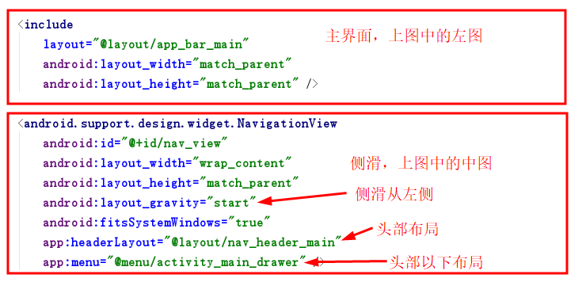

## Android 材料设计

从Android 5.0开始，Android推出了材料设计，材料设计是专为设计适用于多个
平台和设备的视觉、运动与互动效果而制定的综合指南。主要包括TextInputLayout、
SwitchCompat、SnackBar、FloatingActionButton、Shadows、Ripples、TabLayout、
RecyclerView、Card、NavigationView、BottomSheet、Palette控件。

Google在2015的IO大会上，给我们带来了更加详细的Material Design设计规范，
同时，也给我们带来了全新的Android Design Support Library，在这个support
库里面，Google给我们提供了更加规范的MD设计风格的控件。最重要的是，Android
Design Support Library的兼容性更广，直接可以向下兼容到Android 2.2。这不得
不说是一个良心之作。

关于这些控件的使用，直接百度即可发现大量的教程，请自行验证。在这里，我们从
实用的角度出发，着重介绍常用的一些布局方式。

在前面的学习中，都是使用“Empty Activity”模板，如下图：


### 1. Navigation Drawer Activity
- 1.1 在创建项目时，选择“Navigation Drawer Activity”；


- 1.2 运行项目，查看运行效果，如下图：


- 1.3 首先，看一下MainActivity的布局文件：activity_main.xml，代码如下：
```
<?xml version="1.0" encoding="utf-8"?>
<android.support.v4.widget.DrawerLayout xmlns:android="http://schemas.android.com/apk/res/android"
    xmlns:app="http://schemas.android.com/apk/res-auto"
    xmlns:tools="http://schemas.android.com/tools"
    android:id="@+id/drawer_layout"
    android:layout_width="match_parent"
    android:layout_height="match_parent"
    android:fitsSystemWindows="true"
    tools:openDrawer="start">

    <include
        layout="@layout/app_bar_main"
        android:layout_width="match_parent"
        android:layout_height="match_parent" />

    <android.support.design.widget.NavigationView
        android:id="@+id/nav_view"
        android:layout_width="wrap_content"
        android:layout_height="match_parent"
        android:layout_gravity="start"
        android:fitsSystemWindows="true"
        app:headerLayout="@layout/nav_header_main"
        app:menu="@menu/activity_main_drawer" />

</android.support.v4.widget.DrawerLayout>
```
- 1.3.1 DrawerLayout

DrawerLayout是谷歌官方推出了一种侧滑菜单的实现方式（抽屉效果），这个类是
在Support Library里的，需要加上android-support-v4.jar这个包。

**使用注意点**

1、DrawerLayout的第一个子元素必须是默认内容，即抽屉没有打开时显示的布局
（如FrameLayout），后面紧跟的子元素是抽屉内容，即抽屉布局（如ListView）。

2、抽屉菜单的摆放和布局通过android:layout_gravity属性来控制，可选值为
left、right或start、end。

3、抽屉菜单的宽度为 dp 单位而高度和父View一样。抽屉菜单的宽度应该不超过
320dp，这样用户可以在菜单打开的时候看到部分内容界面。

4、打开抽屉： DrawerLayout .openDrawer(); 关闭抽屉：DrawerLayout.closeDrawer( );



虽然这样已经可以从左侧拉出侧滑视图，但是大多数情况下需要让Toolbar和DrawerLayout
联动，可以使用系统定义好的类：ActionBarDrawerToggle，在Activity的onCreate方法添加
如下代码：
```
DrawerLayout drawer = (DrawerLayout) findViewById(R.id.drawer_layout);
        ActionBarDrawerToggle toggle = new ActionBarDrawerToggle(
                this, drawer, toolbar,
                R.string.navigation_drawer_open,
                R.string.navigation_drawer_close);
        drawer.addDrawerListener(toggle);
        toggle.syncState();
```
在按下“返回”键时，如果侧滑已打开，则首先关闭侧滑菜单，代码如下：
```
@Override
    public void onBackPressed() {
        DrawerLayout drawer = (DrawerLayout) findViewById(R.id.drawer_layout);
        //如果侧滑已经打开，关闭侧滑
        if (drawer.isDrawerOpen(GravityCompat.START)) {
            drawer.closeDrawer(GravityCompat.START);
        } else {
            super.onBackPressed();
        }
    }
```
处理侧滑菜单的item单击事件，代码如下：
```
    @SuppressWarnings("StatementWithEmptyBody")
    @Override
    public boolean onNavigationItemSelected(MenuItem item) {
        // Handle navigation view item clicks here.
        //处理导航视图（侧滑）的item单击事件
        int id = item.getItemId();

        if (id == R.id.nav_camera) {
            // Handle the camera action
        } else if (id == R.id.nav_gallery) {

        } else if (id == R.id.nav_slideshow) {

        } else if (id == R.id.nav_manage) {

        } else if (id == R.id.nav_share) {

        } else if (id == R.id.nav_send) {

        }

        DrawerLayout drawer = (DrawerLayout) findViewById(R.id.drawer_layout);
        drawer.closeDrawer(GravityCompat.START);
        return true;
    }
```

> 补充：include标签
该标签的目的是解决重复定义布局的问题而诞生的，提高代码的复用。

- 1.3.2 CoordinatorLayout

在Google I/O 15上，谷歌发布了一个新的 support library，里面包含了一些遵循Material Design's spec
的UI组件，比如，AppbarLayout, CollapsingToolbarLayout 和 CoordinatorLayout。
这些组件配合起来使用可以产生强大的效果，那么让我们通过这篇文章来学习如何使用这些组件。

-- CoordinatorLayout
从名字可以看出，这个ViewGroup是用来协调它的子View的。看下图：


这个例子中的各个View相互影响，却被和谐的组织在了一起。这就是使用CoordinatorLayout最简单的实例：
```
<?xml version="1.0" encoding="utf-8"?>
<android.support.design.widget.CoordinatorLayout xmlns:android="http://schemas.android.com/apk/res/android"
    xmlns:tools="http://schemas.android.com/tools"
    xmlns:app="http://schemas.android.com/apk/res-auto"
    android:fitsSystemWindows="true"
    android:layout_width="match_parent"
    android:layout_height="match_parent">

    <android.support.design.widget.AppBarLayout
        android:id="@+id/appbar"
        android:fitsSystemWindows="true"
        android:layout_height="300dp"
        android:layout_width="match_parent">

        <android.support.design.widget.CollapsingToolbarLayout
            android:layout_width="match_parent"
            android:layout_height="match_parent"
            android:fitsSystemWindows="true"
            app:toolbarId="@+id/toolbar"
            app:layout_scrollFlags="scroll|exitUntilCollapsed"
            app:layout_scrollInterpolator="@android:anim/decelerate_interpolator"
            app:contentScrim="?attr/colorPrimary">

            <ImageView
                android:id="@+id/app_bar_image"
                android:fitsSystemWindows="true"
                android:layout_width="match_parent"
                android:layout_height="match_parent"
                android:src="@mipmap/top"
                android:scaleType="centerCrop" />

            <android.support.v7.widget.Toolbar
                android:id="@+id/toolbar"
                android:layout_height="?attr/actionBarSize"
                app:popupTheme="@style/ThemeOverlay.AppCompat.Light"
                android:layout_width="match_parent">

            </android.support.v7.widget.Toolbar>
        </android.support.design.widget.CollapsingToolbarLayout>
    </android.support.design.widget.AppBarLayout>

    <android.support.v4.widget.NestedScrollView
        android:layout_width="match_parent"
        android:layout_height="match_parent"
        app:layout_behavior="android.support.design.widget.AppBarLayout$ScrollingViewBehavior">
        <TextView
            android:layout_width="match_parent"
            android:layout_height="wrap_content"
            android:textSize="20sp"
            android:lineSpacingExtra="8dp"
            android:text="@string/large_text"
            android:padding="@dimen/activity_horizontal_margin"
            />
    </android.support.v4.widget.NestedScrollView>

    <android.support.design.widget.FloatingActionButton
        android:layout_height="wrap_content"
        android:layout_width="wrap_content"
        android:src="@android:drawable/ic_input_add"
        android:layout_gravity="bottom|end"
        android:layout_margin="16dp"
        android:clickable="true" />
</android.support.design.widget.CoordinatorLayout>
```
其中：
android:fitsSystemWindows：默认是true，就是组件都在屏幕内，但是不包括statusBar。
设置成false后，整个屏幕都可以放置组件，没有statusBar和window之分。

AppBarLayout
首先，AppBarLayout是一个LinearLayout，它的子View默认纵向排列， 可以通过一些参数控制子View的滑动行为。

CollapsingToolbarLayout就是这样一个把各种toolbar的效果组合起来的布局，它可以实现toolbar的折叠效果。

app:layout_scrollFlags：是一个非常重要的属性，它里边的取值主要有五种，下面我分别来解释：

                               1.scroll 表示CollapsingToolbarLayout可以滚动（不设置的话头部的ImageView将不能折叠）
                               2.enterAlways 表示底部的滚动控件只要向下滚动，头部就显示出来
                               3.enterAlwaysCollapsed 表示当底部滚动控件滚动见顶时，头部显示出来
                               4.exitUntilCollapsed 表示头部折叠到最小高度时（Toolbar的高度），就不再折叠
                               5.snap 表示在滑动过程中如果停止滑动，则头部会就近折叠（要么恢复原状，要么折叠成一个Toolbar）

app:contentScrim：
表示当ImageView折叠后Toolbar的颜色，这里的颜色我们不可以直接在Toolbar中
设置，因为Toolbar一开始是透明的，只有当ImageView折叠到Toolbar的高度时Toolbar才变为蓝色的。

当图片折叠时，其实是图片的顶部一直在慢慢的隐藏，底部并没有动，那么如果你想要修改这个效果，可以使用下面的属性：

app:layout_collapseMode="parallax"表示ImageView的折叠和CollapsingToolbarLayout的折叠不同步，那么这个不同步到
底是怎样一个不同步法呢？还有另外一个参数来设置不同步的参数，如下：

app:layout_collapseParallaxMultiplier="0.5"表示视觉乘数，该数值的取值为0～1，数值越大，视觉差越大（如果这里的
值为0，则在头部折叠的过程中，ImageView的顶部在慢慢隐藏，底部不动，如果这里的值为1，ImageView的顶部不懂，底部慢
慢隐藏，如果这里的取值为0～1之间，则在折叠的过程中，ImageView的顶部和底部都会隐藏，但是头部和底部隐藏的快慢是
不一样的，具体速度和视觉乘数有关）

app:layout_collapseMode这个属性还有一个取值，是pin，该属性表示当折叠完成时将该控件放在页面的头部.

在使用CollapsingToolbarLayout的时候，我们一般也不再是通过Toolbar来给页面设置title了，因为这个title能够
实现的效果非常有限，那么我们怎么给页面设置Title呢？我们可以通过给CollapsingToolbarLayout设置如下属性来解决Title的问题：

app:title="MyToolBar" 表示给页面设置一个Toolbar

app:collapsedTitleGravity="right" 表示折叠之后Title显示的位置

app:expandedTitleGravity="left|bottom" 表示展开时Title显示的位置

- CoordinatorLayout Behaviors
在上面的示例中，在NestedScrollView中进行上下滑动，可以对AppBarLayout进行折叠和展开，同时NestedScrollView
里面的内容跟着一起滑动，在里面起关键作用的是：

app:layout_behavior="android.support.design.widget.AppBarLayout$ScrollingViewBehavior"

如果将该语句删除，看到的效果如下图：


简单说一下原理：

- 声明layout_behavior的View是子视图child（观察者）
- AppBarLayout为dependency（被观察者）
- 当观察者发现被观察者发生变化时，主动进行调整，在这里就是当AppBarLayout的高度发生变化时，
及时调整NestedScrollView的偏移量实现同步。这也是CoordinatorLayout（协调者布局）的主要作用。
> 注：请参考[coordinatorlayout和behavior解析](http://blog.csdn.net/fanxudonggreat/article/details/78271954)
[android-[译]掌握CoordinatorLayout](https://www.jianshu.com/p/f418bf95db2d)
[一个神奇的控件——Android CoordinatorLayout与Behavior使用指南](https://www.jianshu.com/p/488283f74e69)

- 1.3.3 FloatingActionButton
在app_bar_main.xml布局文件的最后，使用了一个新的控件：FloatingActionButton，在
MainActivity中相关代码如下：
```
        FloatingActionButton fab = (FloatingActionButton) findViewById(R.id.fab);
        fab.setOnClickListener(new View.OnClickListener() {
            @Override
            public void onClick(View view) {
                Snackbar.make(view, "Replace with your own action", Snackbar.LENGTH_LONG)
                        .setAction("Action", null).show();
            }
        });
```
运行效果如下图：


> Snackbar的作用和Toast类似，可以用来替代Toast。

> FloatingActionButton的其他用法请参考[Android Design Support Library--FloatingActionButton及其Behavior的使用](http://blog.csdn.net/wei_smile/article/details/51375170)
[FloatingActionButton(悬浮按钮)使用学习](https://www.cnblogs.com/sanfeng4476/p/6112284.html)


