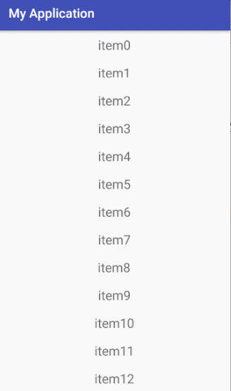
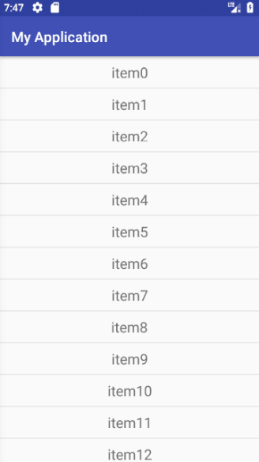
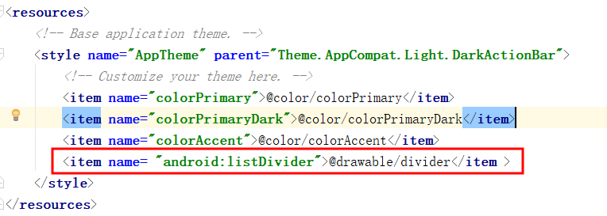
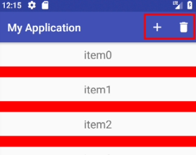
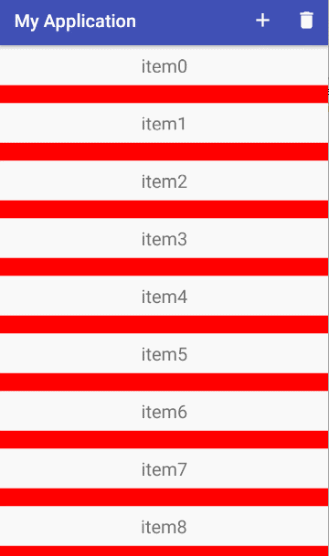

# RecyclerView
自Android 5.0之后，谷歌公司推出了RecylerView控件，RecylerView,看到一个新名词
后大部分人会首先发出一个疑问，recylerview是什么？为什么会有recylerview也就是说
recylerview的优点是什么？recylerview怎么用？
## 1.RecyclerView是什么？
RecylerView是support-v7包中的新组件，是一个强大的滑动组件，与经典的ListView相比，
同样拥有item回收复用的功能，这一点从它的名字recylerview即回收view也可以看出。看到
这也许有人会问，不是已经有ListView了吗，为什么还要RecylerView呢？这就牵扯到第二个问题了。
## 2.RecyclerView的优点是什么？
根据官方的介绍RecylerView是ListView的升级版，既然如此那RecylerView必然有它的优点，
现就RecylerView相对于ListView的优点罗列如下：
- ①RecylerView封装了viewholder的回收复用，也就是说RecylerView标准化了ViewHolder，
编写Adapter面向的是ViewHolder而不再是View了，复用的   逻辑被封装了，写起来更加简单。
- ②提供了一种插拔式的体验，高度的解耦，异常的灵活，针对一个Item的显示RecylerView专门
抽取出了相应的类，来控制Item的显示，使其的扩展性非常强。例如：你想控制横向或者纵向滑动
列表效果可以通过LinearLayoutManager这个类来进行控制(与GridView效果对应的是GridLayoutManager,
与瀑布流对应的还有StaggeredGridLayoutManager等)，也就是说RecylerView不再拘泥于ListView的线性
展示方式，它也可以实现GridView的效果等多种效果。你想控制Item的分隔线，可以通过继承RecylerView
的ItemDecoration这个类，然后针对自己的业务需求去抒写代码。
- ③可以控制Item增删的动画，可以通过ItemAnimator这个类进行控制，当然针对增删的动画，
RecylerView有其自己默认的实现。
## 3.RecyclerView的用法

### 3.1 RecyclerView的初步用法(包括RecyclerView.Adapter用法)
说了这么多，可能大家最关心的就是RecylerView应该怎么用，我们先来讨论讨论RecylerView的
用法的理论知识，然后结合一个实例来体验一下RecylerView的优势首先我们需要明白的一点是使
用RecylerView必须导入support-v7包，在上面我提到过RecylerView高度的解耦，异常的灵活谷
歌给我们提供了多个类来控制Item的显示。
```
recyclerView = (RecyclerView) findViewById(R.id.recyclerView);
LinearLayoutManager layoutManager = new LinearLayoutManager(this );
//设置布局管理器
recyclerView.setLayoutManager(layoutManager);
//设置为垂直布局，这也是默认的
layoutManager.setOrientation(OrientationHelper. VERTICAL);
//设置Adapter
recyclerView.setAdapter( recycleAdapter);
 //设置分隔线
recyclerView.addItemDecoration( new DividerGridItemDecoration(this ));
//设置增加或删除条目的动画
recyclerView.setItemAnimator( new DefaultItemAnimator());
```
可以看到对RecylerView的设置过程，比ListView要复杂一些，这也是RecylerView高度解耦的表现，
虽然代码书写上有点复杂，但它的扩展性是极高的。

实例：接着来几个小的实例帮助大家更深入的了解RecyclerView的用法，首先来实现一个最简单的列表，效果如下:




- 第一步：新建一个Module：RecyclerViewDemo；
- 第二步：在MainActivity的布局文件中添加一个RecyclerView；（详见activity_main.xml）
- 第三步：和ListView类似，需要给RecyclerView包含的Item定义一个布局（详见list_item.xml）,只包含一个TextView；
- 第四步：为RecyclerView定义适配器，代码如下：
```
public class MyRecyclerAdapter extends RecyclerView.Adapter<MyRecyclerAdapter.MyViewHolder> {
    private List<String> mDatas;
    private Context mContext;
    private LayoutInflater inflater;
    public MyRecyclerAdapter(Context context, List<String> datas){
        this. mContext=context;
        this. mDatas=datas;
        inflater=LayoutInflater. from(mContext);
    }
    //重写onCreateViewHolder方法，返回一个自定义的ViewHolder
    @Override
    public MyViewHolder onCreateViewHolder(ViewGroup parent, int viewType) {
        View view = inflater.inflate(R.layout.list_item,parent, false);
        MyViewHolder holder= new MyViewHolder(view);
        return holder;
    }
    //填充onCreateViewHolder方法返回的holder中的控件
    @Override
    public void onBindViewHolder(MyViewHolder holder, int position) {
        holder.tv.setText( mDatas.get(position));
    }

    @Override
    public int getItemCount() {
        return mDatas.size();
    }

    class MyViewHolder extends RecyclerView.ViewHolder {
        TextView tv;
        public MyViewHolder(View view) {
            super(view);
            tv=(TextView) view.findViewById(R.id.textView);
        }
    }
}
```
RecyclerView的Adapter
与ListView的Adapter还是有点区别的，RecyclerView.Adapter，需要实现3个方法：
- ①onCreateViewHolder()
    这个方法主要生成为每个Item inflater出一个View，但是该方法返回的是一个ViewHolder。该方法把View直
    接封装在ViewHolder中，然后我们面向的是ViewHolder这个实例，当然这个ViewHolder需要我们自己去编写。
    直接省去了当初的convertView.setTag(holder)和convertView.getTag()这些繁琐的步骤。
- ②onBindViewHolder()
     这个方法主要用于适配渲染数据到View中。方法提供给你了一个viewHolder，而不是原来的convertView。
- ③getItemCount()
      这个方法就类似于BaseAdapter的getCount方法了，即总共有多少个条目。

可以看到RecyclerView标准化了ViewHolder，编写 Adapter面向的是ViewHoder而不在是View了，复用的逻辑被
封装了，写起来更加简单。其实它的写法与BaseAdapter的写法是差不多的，大家可以对比下它与getView方法写
法的区别，在onCreateViewHolder方法中初始化了一个View，然后返回一个ViewHolder，这个返回的ViewHolder
类似于之前在getView中的convertView.getTag()，然后在onBindViewHolder方法中去给这个ViewHolder中的控件
填充值。其实它的原理跟getView是差不多的，只是做了封装，我们写起来比较简洁。
- 第五步：修改MainActivity.java文件，获取RecyclerView，并绑定相应的适配器；代码如下：
```
public class MainActivity extends AppCompatActivity {
    private RecyclerView recyclerView;
    private List<String> mDatas;
    private MyRecyclerAdapter recycleAdapter;
    @Override
    protected void onCreate(Bundle savedInstanceState) {
        super.onCreate(savedInstanceState);
        setContentView(R.layout.activity_main);
        //1.获取RecyclerView组件
        recyclerView = (RecyclerView) findViewById(R.id.recyclerView );
        //2.初始化数据
        initData();
        //3.实例化布局管理器和适配器
        LinearLayoutManager layoutManager = new LinearLayoutManager(this);
        //设置为垂直布局，这也是默认的
        layoutManager.setOrientation(OrientationHelper.VERTICAL);
        //设置布局管理器
        recyclerView.setLayoutManager(layoutManager);
        recycleAdapter= new MyRecyclerAdapter(MainActivity.this , mDatas );
        //设置Adapter
        recyclerView.setAdapter( recycleAdapter);
    }
    private void initData() {
        mDatas = new ArrayList<String>();
        for ( int i=0; i < 40; i++) {
            mDatas.add( "item"+i);
        }
    }
}
```

可能有很多人会说，这效果太丑了，连个分隔线都没有，不要急，我们一步一步来。
- 第六步：添加分隔线，在onCreate方法的最后添加如下代码：
```
recyclerView.addItemDecoration(new DividerItemDecoration(this,DividerItemDecoration.VERTICAL));
```



补充：改变分隔条：
- 修改styles.xml，如下：

 

- 其中，divider的定义如下：
```
<?xml version="1.0" encoding="utf-8"?>
<shape xmlns:android="http://schemas.android.com/apk/res/android"
    android:shape="rectangle">
    <!-- 填充的颜色 -->
    <solid android:color ="@color/color_red"/>
    <!--  线条大小 -->
    <size android:height ="20dp" android:width ="1dp"/>
</shape>
```
有关shape的使用，请参考： [Android Shape使用](https://www.jianshu.com/p/ef734937b521)

另外，DividerItemDecoration只是系统提供的一个简单的分隔条，大家可以自定义分隔条，详细的说明请参考：
[Android——RecyclerView入门学习之ItemDecoration(一)](https://www.jianshu.com/p/dda4645c824f)

- 第七步：设置增加或删除条目的动画

为了方便操作，在ActionBar上增加两个图标，如下图所示：



方法如下：首先添加两个图标，然后添加菜单资源，代码如下：
```
<?xml version="1.0" encoding="utf-8"?>
<menu xmlns:app="http://schemas.android.com/apk/res-auto"
    xmlns:android="http://schemas.android.com/apk/res/android">

    <item
        android:id="@+id/item_add"
        android:icon="@drawable/ic_add"
        android:title="增加"
        app:showAsAction="always" />
    <item
        android:id="@+id/item_delete"
        android:icon="@drawable/ic_delete"
        android:title="删除"
        app:showAsAction="always" />
</menu>
```
在MainActivity中添加如下代码即可：
```
@Override
    public boolean onCreateOptionsMenu(Menu menu) {
        getMenuInflater().inflate(R.menu.tool_menu,menu);
        return true;
    }

    @Override
    public boolean onOptionsItemSelected(MenuItem item) {
        switch (item.getItemId())
        {
            case R.id.item_add:
                recycleAdapter.addData(1);
                break;
            case R.id.item_delete:
                recycleAdapter.removeData(1);
                break;
        }
        return true;
    }
```
其中，addData和removeData的代码如下：
```
    public void addData(int position) {
        mDatas.add(position, "Insert One");
        notifyItemInserted(position);
        notifyItemRangeChanged(position, mDatas.size());
    }

    public void removeData(int position) {
        mDatas.remove(position);
        notifyItemRemoved(position);
        notifyItemRangeChanged(position, mDatas.size());
    }
```
在MainActivity的onCreate()方法的最后添加如下代码：

    recyclerView.setItemAnimator(new DefaultItemAnimator());

运行效果：




